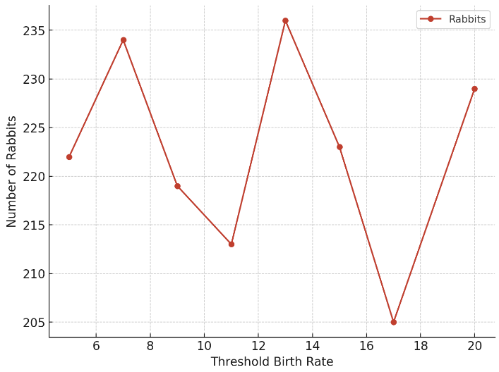
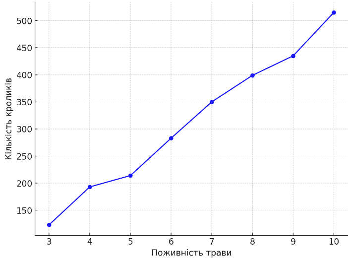
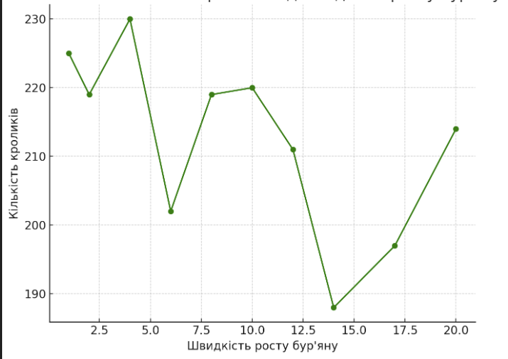

# Комп'ютерні системи імітаційного моделювання
### Виконав студент групи СПм-23-5 Дяченко Максим Сергійович
### Лабораторна робота №1. Опис імітаційних моделей та проведення обчислювальних експериментів

### Варіант 6, модель у середовищі NetLogo

[Rabbits Grass Weeds](https://www.netlogoweb.org/launch#https://www.netlogoweb.org/assets/modelslib/Sample%20Models/Biology/Rabbits%20Grass%20Weeds.nlogo) - моделювання екосистеми, що складається з кроликів, трави і бур'янів

### Вербальний опис моделі

Цей проект досліджує просту екосистему, що складається з кроликів, трави та бур'янів. Кролики блукають довкола випадковим чином, а трава і бур'яни ростуть випадковим чином. Коли кролик натрапляє на траву або бур'яни, він їсть траву і отримує енергію. Якщо кролик отримує достатньо енергії, він розмножується. Якщо енергії не вистачає, він помирає.

### Керуючі параметри

- `number` - початкова кількість кроликів;
- `birth-threshold` - поріг енергії, при якому кролики розмножуються;
- `grass-grow-rate` - швидкість росту трави;
- `grass-energy` - кількість енергії, яку дає трава кролику, котрий її з'їдає;
- `weeds-grow-rate` - швидкість росту бур'янів;
- `weed-energy` - кількість енергії, яку дає бур'ян кролику, котрий його з'їдає;

### Внутрішні параметри

- `pcolor` - змінна для кольорів патчів, щоб візуалізувати ріст трави (зелений патч) та бур'янів (фіолетовий патч)
- `energy` (в змінній `rabbits-own`) - поточна кількість енергії кролика

### Показники роботи системи

- `grass` - кількість трави, що виросла в певний момент часу
- `rabbits` - кількість живих кроликів в певний момент часу
- `weeds` - кількість бур'янів в певний момент часу

### Примітки

Траву і бур'яни можна налаштувати так, щоб вони росли з різною швидкістю і давали кроликам різну кількість енергії. Модель можна використовувати для дослідження конкурентних переваг цих змінних.

### Недоліки моделі

- Для всіх кроликів приміняється один і той самий поріг енергії, долаючи який кролики розмножуються.
- Кролики рухаються випадковим чином, що не гарантує, що вони будуть шукати траву, наприклад, якщо у них лишилось мало енергії.
- Випадкова генерація бур'янів практично не впливає на поведінку моделі під час симуляції, як це можна зрозуміти з третього експерименту.
- Згідно опису процедури `grow-grass-and-weeds`, трава та бур'яни можуть рости лише на порожніх клітинках (`if pcolor = black`). В реальності же, трава зазвичай росте менше і гірше там, де більше бур'янів, до того ж бур'яни можуть розростатись по траві, тим самим, знищуючи її, тощо.

## Обчислювальні експерименти

### 1. Вплив порогу народжуваності на популяцію кроликів

В даному експерименті досліджується, яка буде остаточна кількість кроликів при певному порозі їх народжуваності протягом 500 тактів (ticks). Кількість кроликів (параметр `number`) - 50. Кількість симуляцій - 8. Всі інші параметри - встановлені за замовчуванням:

- `grass-grow-rate` - 15;
- `grass-energy` - 5;
- `weeds-grow-rate` - 0;
- `weed-energy` - 0;

| Поріг народжуваності | Кількість кроликів |
| -------------------- | ------------------ |
| 20                   | 229                |
| 17                   | 205                |
| 15                   | 223                |
| 13                   | 236                |
| 11                   | 213                |
| 9                    | 219                |
| 7                    | 234                |
| 5                    | 222                |

На основі цього графіка можна зрозуміти, що зміна значення порогу народжуванності сама по собі незначно вливає на популяцію кроликів.

### 2. Вплив поживності трави на популяцію кроликів

В даному експерименті буде продемонстровано, як різна поживність трави вливає на розмноження кроликів. Кількість симуляцій - 8. Кількість кроликів (параметр `number`) - 50. Всі інші параметри - встановлені за замовчуванням.

- `birth-threshold` - 15;
- `grass-grow-rate` - 15;
- `weeds-grow-rate` - 0;
- `weed-energy` - 0;

| Поживність трави | Кількість кроликів |
| ---------------- | ------------------ |
| 10               | 515                |
| 9                | 435                |
| 8                | 399                |
| 7                | 350                |
| 6                | 283                |
| 5                | 214                |
| 4                | 193                |
| 3                | 123                |

На основі цього графіку можна зрозуміти, що поживність трави практично пропорційно впливає на популяцію кроликів.

### 3. Вплив появи бур'янів на популяцію кроликів

В даному експерименті буде продемонстровано, як поява бур'янів і швидкість їх росту впливає на розмноження кроликів. Справедливо, що бур'ян буде заважати росту трави, і коли кролики з'їдатимуть бур'ян, вони не будуть отримувати енергії (стандартне значення параметру `weed-energy` - 0). Кількість симуляцій - 10. Кількість кроликів (параметр `number`) - 50. Всі інші параметри - встановлені за замовчуванням.

- `birth-threshold` - 15;
- `grass-grow-rate` - 15;
- `grass-energy` - 5;
- `weed-energy` - 0;

| Швидкість росту бур'яну | Кількість кроликів |
| ----------------------- | ------------------ |
| 1                       | 225                |
| 2                       | 219                |
| 4                       | 230                |
| 6                       | 202                |
| 8                       | 219                |
| 10                      | 220                |
| 12                      | 211                |
| 14                      | 188                |
| 17                      | 197                |
| 20                      | 214                |

Даний графік показує, що поява бур'янів і збільшення швидкості їх росту не значно впливають на популяцію кроликів.
